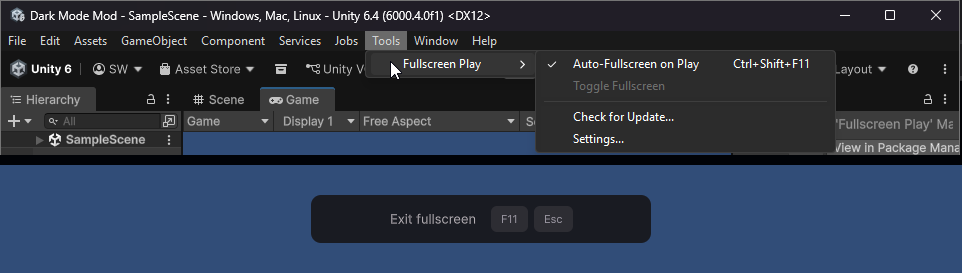

# Unity Fullscreen Play

Test your game in true fullscreen directly from the Unity Editor — no build required.

Adds a **Play Fullscreen** toggle that launches the Game view as a borderless fullscreen window when you enter Play mode. Press **Esc** or **F11** to return to the normal editor.



## Features

- **Tools menu** — Tools > Fullscreen Play with auto-fullscreen on play (Ctrl+Shift+F11), toggle fullscreen (F11), check for update, and settings
- **F11 hotkey** — toggle fullscreen on/off during Play mode
- **Ctrl+Shift+F11** — toggle auto-fullscreen on play setting
- **Esc to exit** — press Escape to leave fullscreen without stopping Play
- **Game view parity** — fullscreen mirrors Gizmos, Stats, VSync, Low Resolution Aspect Ratios, XR render mode, and No Camera Warning from your Game view
- **Toast notification** — brief overlay showing exit instructions (configurable)
- **Fullscreen Windowed** mode — Exclusive Fullscreen deferred (requires display resolution change via Win32, risky in-editor if Unity crashes mid-session)
- **Settings panel** in Edit > Preferences > Fullscreen Play (fully localized)
- **Check for Update** — one-click update check via Tools > Fullscreen Play > Check for Update
- **Non-destructive** — your editor layout is never modified; fullscreen is a separate popup window
- **Quit-shortcut safety** — Alt+F4 (Windows), Cmd+Q/Cmd+W (macOS), and Ctrl+Q (Linux) exit fullscreen instead of quitting Unity
- **Crash recovery** — if Unity crashes or is killed while fullscreen is active, the orphaned popup window is automatically cleaned up on the next editor startup
- **Clean enable/disable** — no leaks or stale state when toggling the package
- **Localization** — English and German, extensible via JSON files in `Editor/Locales/`
- **Windows** supported (macOS/Linux: fullscreen windowed only)

## Requirements

- Unity 6 (6000.0) or later
- Git (for package installation)

## Installation

### Option A — Git URL (recommended)

1. In Unity, open **Window > Package Manager**
2. Click the **+** button > **Install package from git URL...**
3. Paste:
   ```
   https://github.com/Shilo/unity-fullscreen-play.git
   ```

To pin a specific version, append a tag:
```
https://github.com/Shilo/unity-fullscreen-play.git#v0.1.0
```

### Option B — Edit manifest.json

Add this line to your project's `Packages/manifest.json`:
```json
{
  "dependencies": {
    "com.shilo.fullscreen-play": "https://github.com/Shilo/unity-fullscreen-play.git"
  }
}
```

## Usage

### Auto-fullscreen on Play
1. Go to **Tools > Fullscreen Play > Auto-Fullscreen on Play** (toggle with checkmark)
2. Press Play as usual — the Game view fills the entire screen
3. Press **Esc** or **F11** to exit fullscreen

### Manual fullscreen (during Play mode)
- Press **F11** to toggle fullscreen
- Use **Tools > Fullscreen Play > Toggle Fullscreen** or press **F11**
- These are greyed out when not in Play mode

### Check for Update
Use **Tools > Fullscreen Play > Check for Update...** to fetch and install the latest version from the Git repository.

### Settings
Open **Edit > Preferences > Fullscreen Play** to configure:

| Setting | Default | Description |
|---------|---------|-------------|
| Play Fullscreen | Off | Auto-fullscreen on entering Play mode |
| Fullscreen Mode | Fullscreen Windowed | Currently locked; exclusive fullscreen planned |
| Enable F11 Hotkey | On | Allow F11 to toggle fullscreen |
| Show Toast | On | Show exit instructions overlay |
| Show on Refocus | On | Re-show toast when fullscreen window regains focus |
| Toast Duration | 3s | How long the toast is visible |

The F11 hotkey can be rebound in **Edit > Shortcuts** under "Fullscreen Play".

## How It Works

Unity's Game tab is internally an `EditorWindow` called `GameView`. This package creates a **second** GameView instance and shows it as a borderless popup window sized to cover your entire screen. Both GameViews render the game simultaneously — the original stays safely docked in your editor layout, and the fullscreen one overlays everything.

When you exit fullscreen (Esc, F11, or stopping Play), the popup is simply closed. Your editor layout is never modified — there's nothing to restore.

**Crash recovery** — If Unity crashes or is force-killed while fullscreen is active, the popup window can survive in the saved editor layout. On the next startup, the package detects orphaned fullscreen windows and closes them automatically, restoring your normal layout.

**Quit-shortcut safety** — Because the fullscreen window looks like a standalone app, users instinctively press Alt+F4 (Windows), Cmd+Q or Cmd+W (macOS), or Ctrl+Q (Linux) to close it. On Windows, Alt+F4 naturally closes only the fullscreen popup (it's a separate window). On macOS and Linux, application-level quit shortcuts (Cmd+Q, Ctrl+Q) are intercepted via `EditorApplication.wantsToQuit` — fullscreen exits and the quit is cancelled so the editor stays open.

**On Windows**, the popup window alone wouldn't cover the taskbar, so native Win32 APIs (`SetWindowPos`, `SetWindowLong`) strip the window chrome and position it across the full screen. Alt-tab works normally — the fullscreen window doesn't pin itself above other applications.

For the full technical deep-dive, see [DOCUMENTATION.md](DOCUMENTATION.md).

## License

[MIT](LICENSE)
